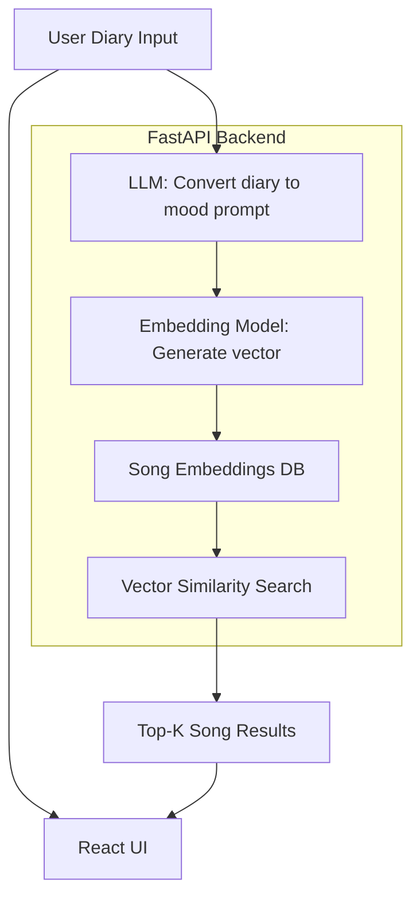

# 🎵 Daily Diary → Music  
**Tell your day, get songs that match your vibe — powered by AI embeddings + LLM mood rewriting**

Every day has a feeling — your music should match it.  
This app turns your diary entry into a playlist vibe using **sentence embeddings + LLM mood normalization**.

> 🧠 You write your mood → 🤖 AI understands → 🎶 playlist suggestions appear

---
## DATASET
>https://www.kaggle.com/datasets/mateibejan/multilingual-lyrics-for-genre-classification/data?select=train.csv
---

## ✨ Features

✅ Write what happened in your day  
✅ LLM rewrites it into a mood-based music search prompt  
✅ Embedding-based similarity search returns matching tracks  
✅ Optional language filter (English, Spanish, Hindi, etc.)  
✅ Beautiful React UI + realtime results  
✅ Pure local embedding retrieval (no external DB)

---

## 🧠 Tech Stack

| Layer | Technology |
|------|-----------|
| Backend | FastAPI |
| LLM | Gemini 2.5 Flash |
| Embeddings | Sentence Transformers |
| Frontend | React + Vite |
| UI | Tailwind CSS |
| Data | Precomputed song embedding dataset |

---
## 🏗️ Architecture

---

